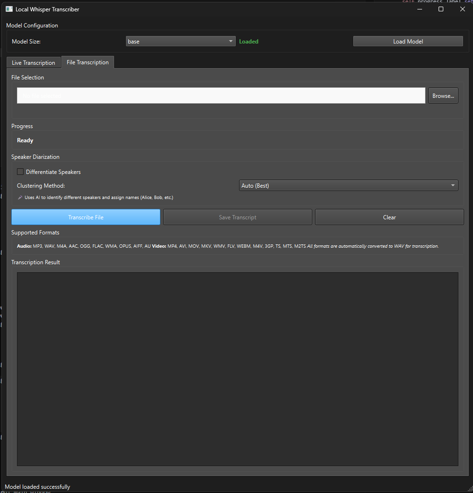
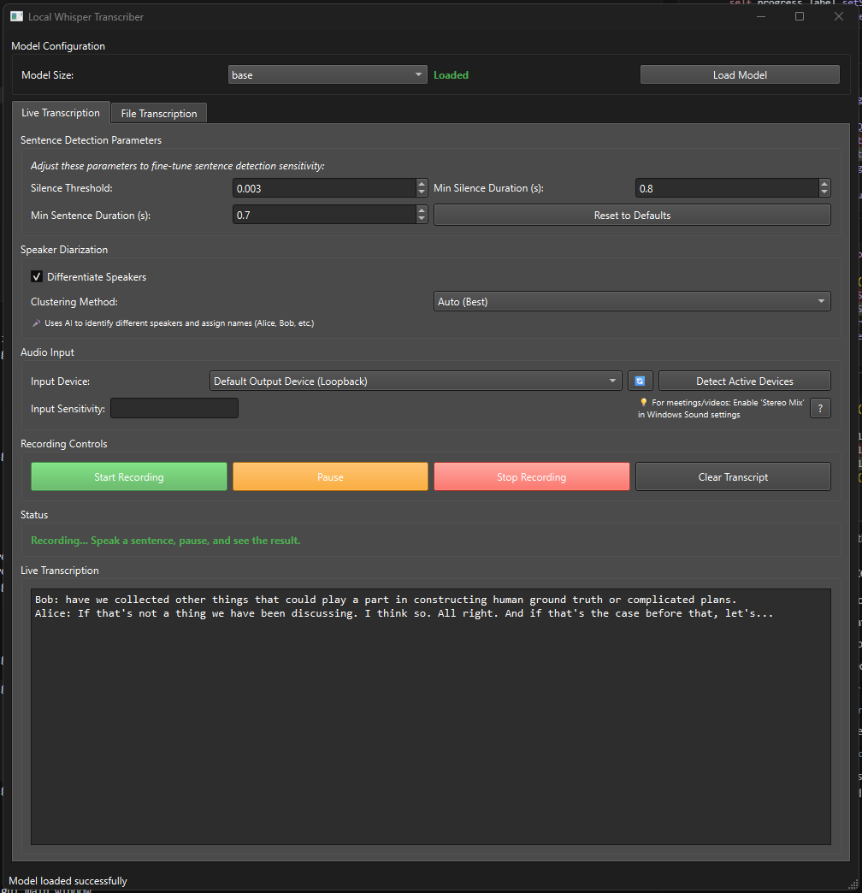

# Local Whisper Transcribe Service

This repository implements a local, fully offline transcription system leveraging OpenAI's Whisper model. The system is designed for both real-time and file-based audio transcription, with a focus on privacy, extensibility, and empirical utility. All computation is performed on the user's hardware; no data is sent to external servers.

## System Overview

The codebase is structured around a modular core (audio handling, model inference) and a PyQt6-based graphical interface. The primary objective is to provide robust, accurate transcription for both live and pre-recorded audio, with advanced features such as speaker diarization and multi-format support.

### Core Components

- **WhisperModel**: A wrapper around the Whisper inference API, supporting dynamic model selection, device management (CUDA/CPU), and both file and in-memory array transcription. The class exposes methods for segment-wise and batch transcription, as well as utilities for merging and post-processing transcripts.
- **AudioHandler**: Real-time audio capture with VAD (Voice Activity Detection) using WebRTC. Implements a rolling buffer and segment emission logic, suitable for both interactive and automated transcription pipelines. Supports device enumeration, recording control, and file I/O.
- **Speaker Diarization**: Optional speaker segmentation is provided via Resemblyzer embeddings and multiple clustering algorithms (Agglomerative, DBSCAN, Spectral). The system heuristically selects the best clustering method using silhouette scores, and assigns canonical names to speaker clusters.

### User Interface

The PyQt6 GUI exposes two primary workflows:

1. **File Transcription**: Accepts a wide range of audio and video formats, automatically converting to WAV as needed. Users may enable speaker diarization and select clustering methods. The interface displays progress, supported formats, and the resulting transcript.

   

2. **Live Transcription**: Provides real-time transcription from any input device, with adjustable sentence detection parameters (silence threshold, minimum durations). Speaker diarization is available in live mode as well. The interface includes device selection, sensitivity controls, and live transcript display.

   

### Technical Details

- **Dependencies**: The system relies on PyTorch (with optional CUDA), PyQt6, sounddevice, soundfile, webrtcvad, resemblyzer, and scikit-learn, among others. See `requirements.txt` for the full list.
- **Performance**: GPU acceleration is supported and recommended for large models or real-time use. The system is optimized for RTX 3060 and above, but will fall back to CPU if necessary.
- **Privacy**: All processing is local. No audio or transcript data leaves the host machine.
- **Extensibility**: The codebase is modular, with clear separation between core logic and UI. Advanced users may extend or replace components (e.g., diarization, VAD, model backend) as needed.

### Limitations

- The GUI is monolithic and may benefit from further modularization.
- Speaker diarization is computationally intensive and may not be suitable for all hardware.
- Installation may require careful management of dependencies, especially for CUDA and audio libraries.

## License

MIT License. See LICENSE file for details. 